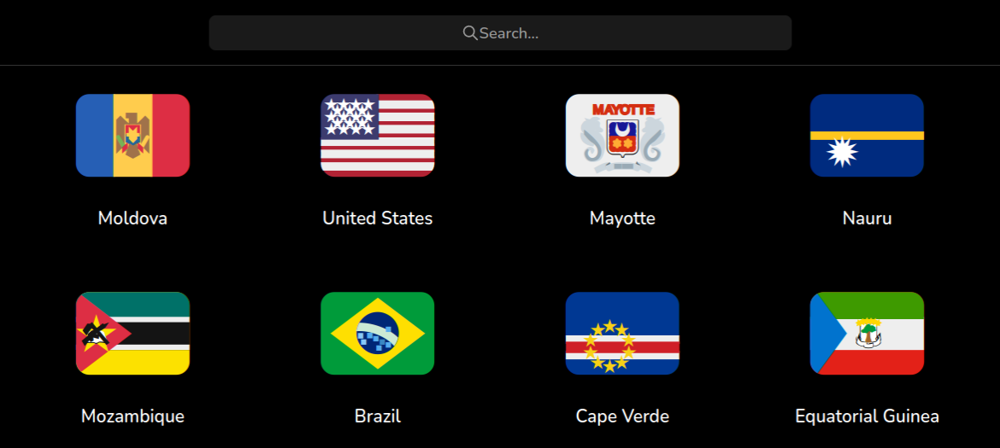

<div align="center">




</div>

---

Country Info provides a list of countries and a little information about each country using the [restcountries.com](https://restcountries.com) API.

---

# How to run it locally

You need to have [Node.js](https://nodejs.org) installed on your machine.

Clone this repository and navigate to the project directory.

Install the project dependencies with the following command:

```shell
npm install
```

Once the installation is complete, you can start a development server:

```shell
npm run dev
```

You can view the project by navigating to [`localhost:3000`](http://localhost:3000) in your browser.
